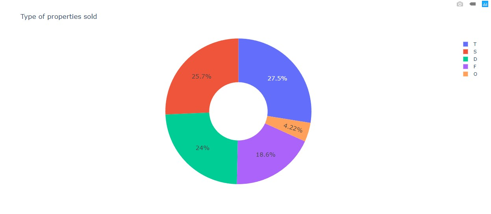
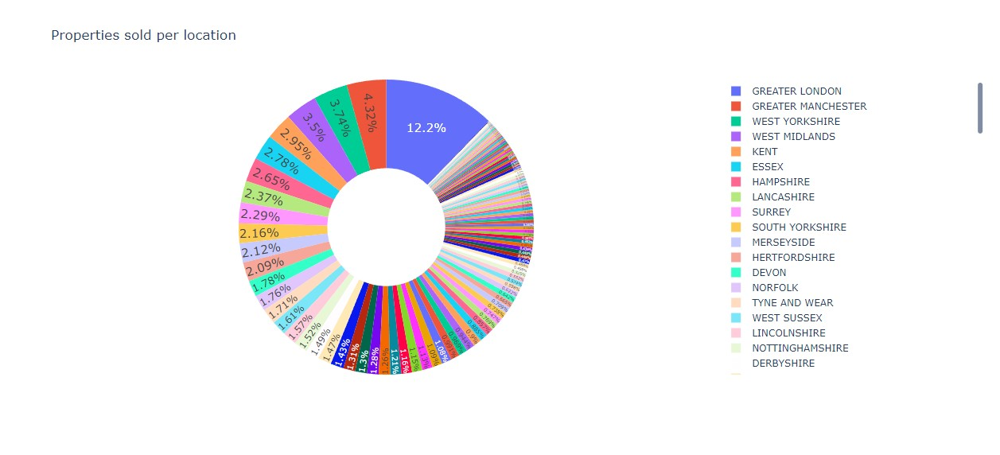
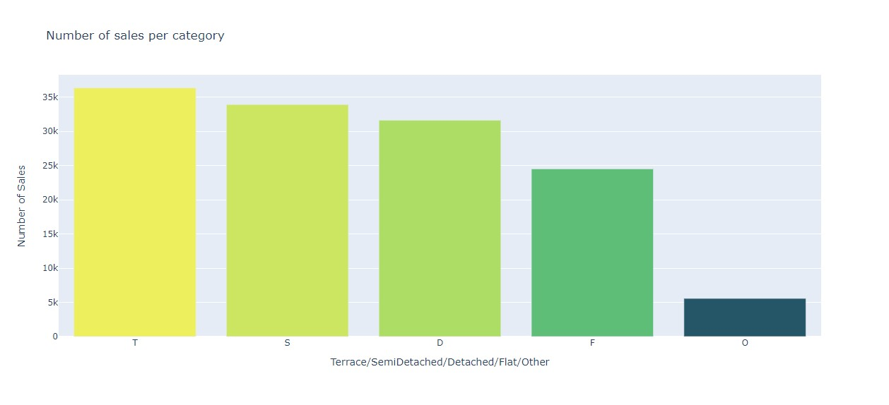
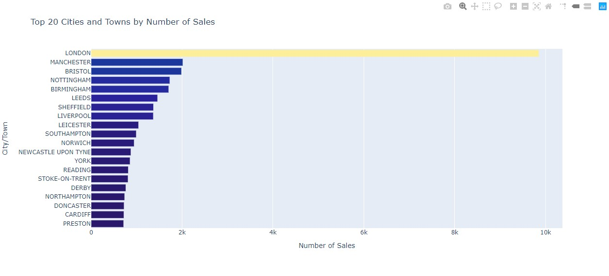
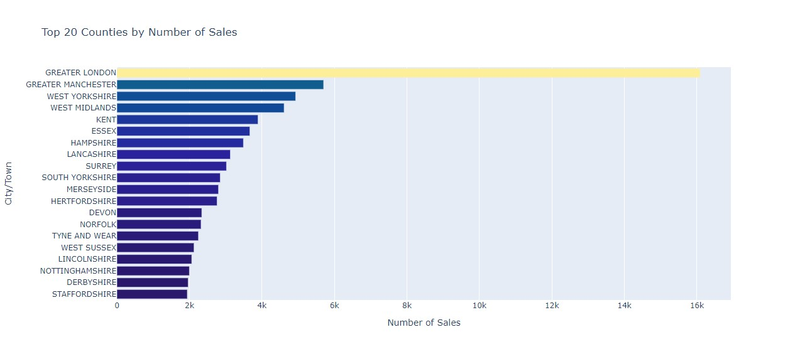
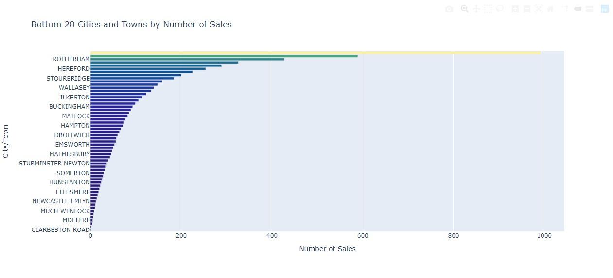
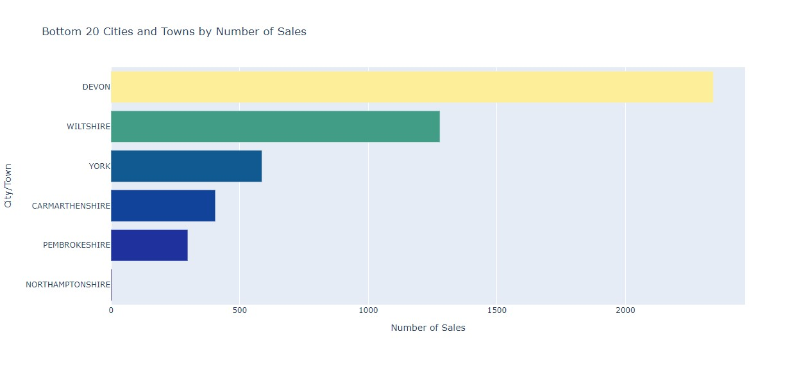
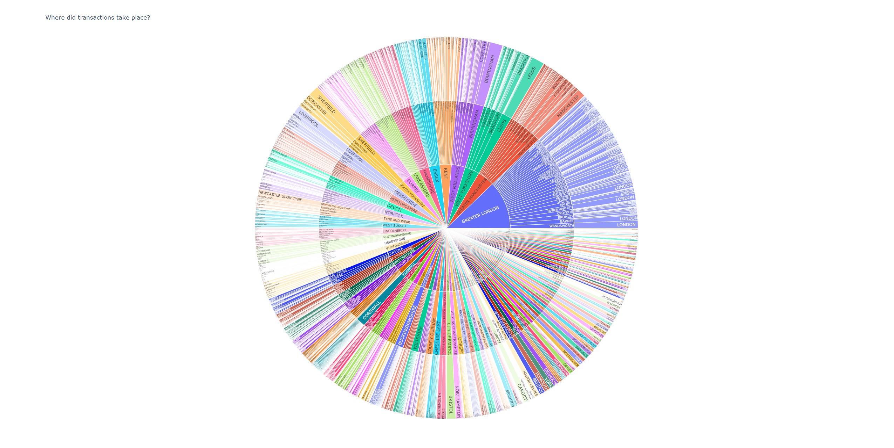
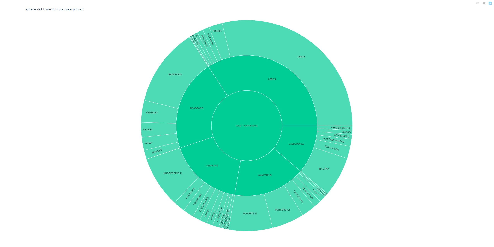

# HM-land-registry-data
Data analysis of HM Land Registry transactions

<code>HM-land-registry-data</code> is a simple Python script that allows the user to analyse the large dataset from https://www.gov.uk/guidance/about-the-price-paid-data#download-options.

## How it works

The code is WIP. Currently there are several functionalities:

Loads the csv data downloaded from the gov website, converts it to pandas dataframe and adds headers.

Cleans the data by removing transactions which do not have postcodes (optional)

<code>add_latlon(dataset, filename)</code> functionality goes through all of the transactions and adds latitude and longitude for the property. This works with pgeocode Python library. Updated csv file will be saved as "filename"

<code>type_sold()</code> shows the type of properties sold historically by percentage. T - Terraced, S - SemiDetached, D - Detached, F - Detached, F - Flat, O - Other.

<code>sold_location()</code> shows the percentage of all properties sold per location(county)

<code>sales_per_category()</code> shows the number of sales per category. T - Terraced, S - SemiDetached, D - Detached, F - Detached, F - Flat, O - Other.

<code>top_20_cities()</code> shows the top 20 cities by transaction numbers.

<code>top_20_county()</code> shows the top 20 counties by transaction numbers.

<code>bottom_20_cities()</code> shows the bottom 20 cities by transaction numbers.

<code>bottom_20_county()</code> shows the bottom 20 counties by transaction numbers. (WIP)

<code>location_sunburst())</code> shows the interactive sunburst chart of property transactions per location

